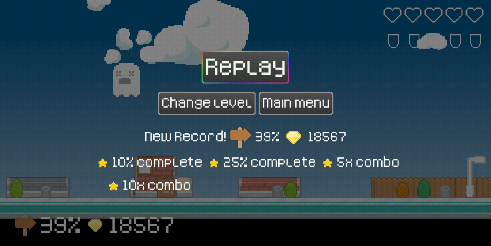

# Beat Feet

   

**Jump your way through cities, each automatically generated from the beat of the music.**

Hit too many buildings, and you will die. Successfully jump from roof to roof, and watch your score soar!

Play through dozens of levels, or use your own MP3 files to generate custom worlds.

No ads. No in game purchases. Just great music and fun times.

Each level consists of obstacles that correspond to the music playing in the background. Every time you play the same level, the size of the obstacles will be the same, but the world will have a different style. No two sessions will look the same.

## Contributing

### Donations

Beat Feet is an open source, GPLv3 game. It will always be freely available via F-Droid, or for anyone to build, fork, or improve via the source code.

If you wish to support the development financially, donations are welcome via:

* [Liberapay](https://liberapay.com/BeatFeet/donate)
* [GitHub sponsors](https://github.com/sponsors/pserwylo)

### Reporting Issues

Please report any issues or suggest features on the [issue tracker](https://github.com/beat-feet/beat-feet/issues).

### Translating

We use [Weblate](https://hosted.weblate.org/engage/beat-feet/) to manage translations. Please see [these instructions for using Weblate](https://hosted.weblate.org/engage/beat-feet/) to translate BabyDots.

|Game strings|F-Droid metadata|
|------------|----------------|
|||

### Submitting changes

Pull requests will be warmly received at [https://github.com/beat-feet/beat-feet](https://github.com/beat-feet/beat-feet).

## Compiling

This app uses a the libgdx library and Kotlin. It is recommended to read the [libgdx documentation to get a dev environment setup](https://libgdx.com/dev/setup/).

Alternatively, you can import the project into Android Studio and build from there.

There are some additional build processes involved in the game:
* `./gradlew :song-extract:processSongs` - Analyses the high bitrate MP3 files from `./songs/original`, extracts features to generate levels, and writes the data to `./android/assets/songs/data/`
* `./songs/downsample.sh` - Takes high bitrate MP3 files from `./songs/original` and reduce to 96Kbps, writing to `./android/assets/songs/mp3/`

Therefore, adding songs is a matter of putting a high bitrate version inside `./songs/original/SONG.mp3`, running `./gradlew :song-extract:processSongs` and then running `./songs/downsample.sh`.
This will make both a low bitrate version and a processed data file available to the game code.
